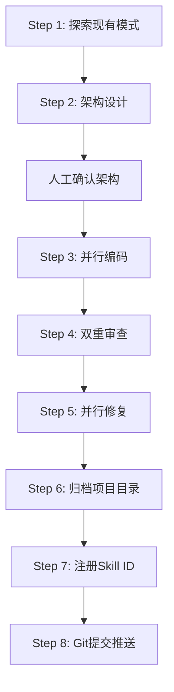

# Skill开发标准工作流（8步法）

## 核心原则

- **先架构设计，后代码实现** — 架构输出→确认→编码实现，不可并行
- **集群Agent并行** — 独立任务并行启动，不串行等待
- **审查→修复→验证闭环** — 自检+安全双重审查
- **所有输出附带免责声明** — 不假装权威、不替代专业人士

## 标准8步流程



### Step 1: 探索现有模式（并行）
- 现有Skill文件结构（YAML frontmatter + references/）
- 现有Agent定义格式
- 项目CLAUDE.md约定

### Step 2: 架构设计（1个architect Agent）
输出完整方案：文件结构、触发机制、状态机、子Agent职责、安全/免责策略

### Step 3: 并行编码（2个Agent）
- Agent A: SKILL.md主文件
- Agent B: references/*.md

### Step 4: 双重审查（2个Agent并行）
- 自检Agent: 结构/触发词/工作流/边界
- 安全Agent: 代码错误/安全漏洞/合规性

### Step 5: 并行修复（2个Agent并行）
- Agent A: CRITICAL + HIGH
- Agent B: MEDIUM + LOW

### Step 6-8: 归档→注册ID→Git推送

## Skill文件结构标准

```
.claude/skills/<skill-name>/
├── SKILL.md              # YAML frontmatter + 完整工作流
└── references/
    ├── dimensions.md
    ├── agent-profiles.md
    ├── disclaimer-templates.md
    ├── phase-transitions.md
    └── conversation-style.md
```

## 质量红线

| 检查项 | 标准 |
|--------|------|
| 文件行数 | <800行（SKILL.md <600行） |
| Agent免责声明 | 每个Prompt末尾必须包含 |
| 免责声明嵌入点 | ≥4处递进嵌入 |
| 安全协议 | 110 + 120 + ≥2条心理热线 |
| 紧急分级 | URGENT / CONCERN 两级 |
| 交叉引用 | 所有路径必须有效 |
| 状态机 | 与SKILL.md阶段完全一致 |

## 相关笔记

- [[Skill开发流程优化]] — 6个识别到的反模式和改进方案
- [[集群Agent并行策略]] — Agent使用模式总结
- [[AI辅助编程]] — 小步验证原则
